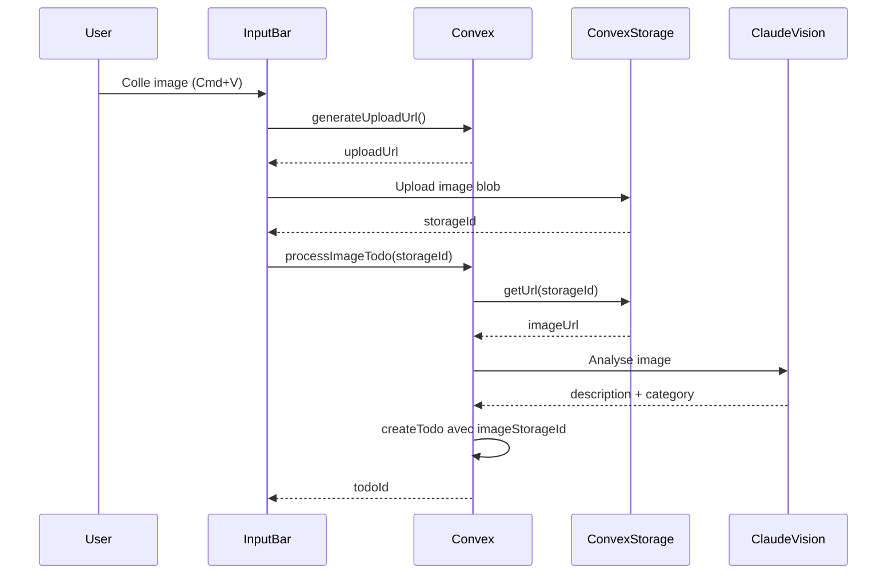

# Fonctionnalité d'analyse d'image pour VoiceTodo

## Overview

Ajouter la possibilité de coller une image (Cmd+V) ou une URL d'image dans l'input, l'analyser avec Claude Vision pour créer un todo, et afficher une mini-thumbnail cliquable qui ouvre un modal.

## Tâches

- [ ] Modifier le schema Convex pour ajouter imageStorageId aux todos
- [ ] Créer la mutation generateUploadUrl pour Convex Storage
- [ ] Créer l'action processImageTodo avec Claude Vision
- [ ] Installer le composant Dialog de shadcn/ui
- [ ] Créer le composant ImagePreviewModal
- [ ] Modifier InputBar pour détecter le collage d'images
- [ ] Modifier TodoItem pour afficher la thumbnail cliquable
- [ ] Intégrer le tout dans page.tsx

## Architecture du flux



## Modifications requises

### 1. Schema Convex - Ajouter le champ image

Fichier: `convex/schema.ts`

```typescript
todos: defineTable({
  // ... champs existants
  imageStorageId: v.optional(v.id("_storage")), // Nouveau champ
})
```

### 2. Backend - Actions pour l'image

Fichier: `convex/ai.ts`

- Ajouter `generateUploadUrl` mutation (pour obtenir une URL d'upload signée)
- Ajouter `processImageTodo` action qui:
  1. Récupère l'URL publique de l'image depuis le storage
  2. Envoie l'image à Claude Vision avec un prompt d'analyse
  3. Crée le todo avec `imageStorageId`

### 3. InputBar - Détection du collage d'image

Fichier: `components/input-bar.tsx`

- Ajouter un handler `onPaste` sur l'input
- Détecter si le clipboard contient une image (`clipboardData.files`)
- Détecter si c'est une URL d'image (regex sur le texte collé)
- Afficher un preview de l'image en cours de traitement
- Nouveau prop: `onImagePaste?: (file: File | string) => void`

### 4. TodoItem - Afficher la thumbnail

Fichier: `components/todo-item.tsx`

- Ajouter prop `imageUrl?: string`
- Afficher une mini-thumbnail (32x32px) cliquable à côté du contenu
- Au clic, ouvrir le modal

### 5. Nouveau composant - ImagePreviewModal

Créer: `components/image-preview-modal.tsx`

- Utiliser Radix Dialog (via shadcn)
- Afficher l'image en grand format
- Bouton pour fermer

### 6. Page principale - Orchestration

Fichier: `app/page.tsx`

- Ajouter state pour le modal (image sélectionnée)
- Passer les URLs d'images aux TodoItem
- Gérer le callback `onImagePaste` de l'InputBar
